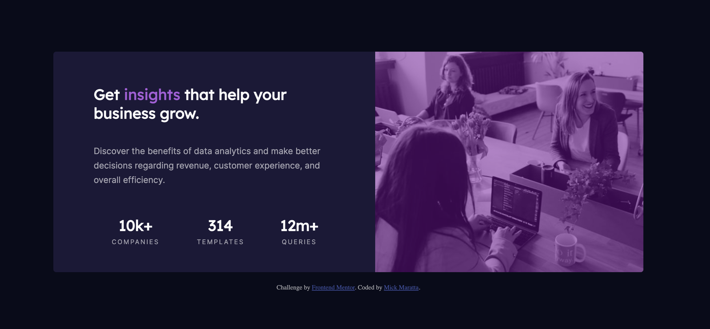

# Frontend Mentor - Stats preview card component solution

This is a solution to the [Stats preview card component challenge on Frontend Mentor](https://www.frontendmentor.io/challenges/stats-preview-card-component-8JqbgoU62). Frontend Mentor challenges help you improve your coding skills by building realistic projects. 

## Table of contents

- [Frontend Mentor - Stats preview card component solution](#frontend-mentor---stats-preview-card-component-solution)
  - [Table of contents](#table-of-contents)
  - [Overview](#overview)
    - [The challenge](#the-challenge)
    - [Screenshot](#screenshot)
    - [Links](#links)
  - [My process](#my-process)
    - [Built with](#built-with)
    - [What I learned](#what-i-learned)
  - [Author](#author)

## Overview

### The challenge

Users should be able to:

- View the optimal layout depending on their device's screen size

### Screenshot



### Links

- Solution URL: [https://github.com/mickmaratta/stats-preview-card-component-main](https://github.com/mickmaratta/stats-preview-card-component-main)
- Live Site URL: [https://mickmaratta.github.io/stats-preview-card-component-main/](https://mickmaratta.github.io/stats-preview-card-component-main/)

## My process

### Built with

- Semantic HTML5 markup
- CSS custom properties
- Flexbox
- Mobile-first workflow

### What I learned

A workaround to transform background images.

To see how you can add code snippets, see below:

```html
<div class="header">
  
  <div class="overlay"></div>
</div>
```
```css
.header {
        width: 50%;
        height: 100%;
        border-radius: 5px 5px 0 0;
    }

.header::before {
    content: "";
    position: absolute;
    width: 200%;
    height: 200%;
    top: -50%;
    left: -50%;
    z-index: 1;
    background: url(../images/image-header-desktop.jpg) no-repeat;
    background-size: cover;
    transform: scale(0.5);
    border-radius: 0 10px 10px 0
  }

.overlay {
    position: absolute;
    top: 0;
    left: 0;
    width: 100%;
    height: 100%;
    background-color: hsla(285, 100%, 30%, 0.5);
    border-radius: 20px 20px 0 0;
    z-index: 99;
}
```

## Author

- Website - [Mick Maratta](https://mickmaratta.github.io/)
- Frontend Mentor - [@mickmarattta](https://www.frontendmentor.io/profile/mickmaratta)
